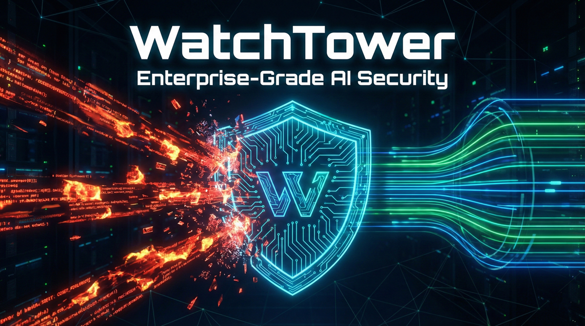
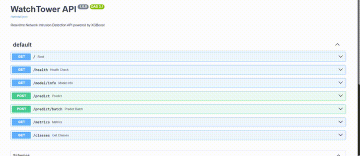

<p align="center">
  
</p>

<p align="center">
  <strong>Enterprise-Grade Network Intrusion Detection with MLOps</strong>
</p>

<p align="center">
  
  
  
  
  
  
</p>

<p align="center">
  <a href="#quick-start">Quick Start</a> •
  <a href="#features">Features</a> •
  <a href="#architecture">Architecture</a> •
  <a href="#api">API</a> •
  <a href="#training">Training</a>
</p>

---

## Demo

<p align="center">
  
</p>

<p align="center">
  <em>FastAPI Swagger UI - Real-time network intrusion detection API</em>
</p>

---

## Overview

**WatchTower** is a production-ready MLOps pipeline for real-time network intrusion detection. Built on the CICIDS2017 dataset with **GPU-accelerated XGBoost**, it achieves state-of-the-art accuracy while providing full observability through MLflow, Prefect, and Prometheus.

### Key Results

| Metric | Value | Benchmark |
|--------|-------|-----------|
| **Accuracy** | 99.877% | 99.89% (SOTA) |
| **F1 Macro** | 95.9% | - |
| **Training Time** | 9s | GPU |
| **Inference** | <5ms | Per prediction |

### Attack Classes Detected

```
Normal Traffic    DDoS           DoS
Port Scanning     Brute Force    Bots
Web Attacks
```

---

## Quick Start

### Prerequisites

- Python 3.11+
- NVIDIA GPU with CUDA (optional, falls back to CPU)
- Docker & Docker Compose (for full stack)

### Installation

```bash
# Clone repository
git clone https://github.com/ahmedtarek-mel/WatchTower.git
cd WatchTower

# Install dependencies
pip install -e .[dev]

# Verify GPU detection
python -c "from src.config.settings import settings; settings.print_config()"
```

### Run the API

```bash
# Start the inference API
python -m uvicorn src.serving.app:app --host 0.0.0.0 --port 8000

# Open API docs
# http://localhost:8000/docs
```

### Train a Model

```bash
# Quick training (2% sample)
python -c "
from src.data.ingestion import load_dataset
from src.data.preprocessing import DataPreprocessor, create_train_val_test_split
from src.training.train import XGBoostTrainer

df = load_dataset(sample_frac=0.02)
preprocessor = DataPreprocessor()
X, y = preprocessor.fit_transform(df)
X_train, X_val, X_test, y_train, y_val, y_test = create_train_val_test_split(X, y)

trainer = XGBoostTrainer(n_estimators=100)
trainer.train(X_train, y_train, X_val, y_val)
trainer.evaluate(X_test, y_test, 'Test')
trainer.save_model()
"
```

---

## Features

### Machine Learning
- **GPU-Accelerated XGBoost** - Automatic CUDA detection
- **Optuna Hyperparameter Tuning** - Bayesian optimization
- **Multi-class Classification** - 7 attack types + normal traffic
- **99.877% Accuracy** - State-of-the-art performance

### MLOps Stack
- **MLflow** - Experiment tracking & model registry
- **Prefect** - Workflow orchestration
- **Prometheus** - Real-time metrics


### Production Ready
- **FastAPI** - High-performance async API
- **Docker** - Containerized deployments
- **GitHub Actions** - CI/CD pipelines
- **Pydantic** - Request/response validation

### Observability
- **Rich Console** - Beautiful training logs
- **Progress Bars** - Real-time visibility
- **Structured Logging** - Loguru integration
- **Health Checks** - Service monitoring

---

## Architecture

```
+---------------------------------------------------------------------+
|                         WatchTower                                   |
+---------------------------------------------------------------------+
|                                                                      |
|  +------------+    +------------+    +------------+                  |
|  | Ingestion  |--->|Preprocessing|--->| Validation |                 |
|  | (CSV/API)  |    | (Features) |    | (Checks)   |                  |
|  +------------+    +------------+    +------------+                  |
|                           |                                          |
|                           v                                          |
|  +------------+    +------------+    +------------+                  |
|  |  Optuna    |<-->|  XGBoost   |--->|  MLflow    |                  |
|  |  (Tuning)  |    |  (GPU)     |    | (Tracking) |                  |
|  +------------+    +------------+    +------------+                  |
|                           |                                          |
|                           v                                          |
|  +------------+    +------------+    +------------+                  |
|  | Prometheus |<---|  FastAPI   |--->|  Clients   |                  |
|  | (Metrics)  |    |  (Serve)   |    |  (Apps)    |                  |
|  +------------+    +------------+    +------------+                  |
|                                                                      |
+---------------------------------------------------------------------+
```

> See [docs/ARCHITECTURE.md](docs/ARCHITECTURE.md) for detailed Mermaid diagrams.

---

## API

### Endpoints

| Endpoint | Method | Description |
|----------|--------|-------------|
| `/health` | GET | Health check |
| `/model/info` | GET | Model metadata |
| `/predict` | POST | Single prediction |
| `/predict/batch` | POST | Batch predictions |
| `/metrics` | GET | Prometheus metrics |
| `/classes` | GET | Attack class list |

### Example Request

```bash
curl -X POST "http://localhost:8000/predict" \
  -H "Content-Type: application/json" \
  -d '{
    "destination_port": 80,
    "flow_duration": 100000,
    "total_fwd_packets": 5,
    "total_length_of_fwd_packets": 500,
    "fwd_packet_length_max": 100,
    "fwd_packet_length_min": 50,
    "fwd_packet_length_mean": 75,
    "fwd_packet_length_std": 25
  }'
```

### Example Response

```json
{
  "prediction": "Normal Traffic",
  "prediction_id": 4,
  "confidence": 0.9999991,
  "probabilities": {
    "Bots": 0.0000008,
    "Brute Force": 0.0000000,
    "DDoS": 0.0000000,
    "DoS": 0.0000000,
    "Normal Traffic": 0.9999991,
    "Port Scanning": 0.0000000,
    "Web Attacks": 0.0000000
  }
}
```

---

## Training

### Full Training Pipeline

```bash
# Run with Prefect orchestration
python -c "from src.flows.training_flow import training_flow; training_flow()"
```

### Hyperparameter Optimization

```bash
# Run Optuna optimization (30 trials)
python run_optimization.py
```

### Best Hyperparameters Found

| Parameter | Value |
|-----------|-------|
| n_estimators | 377 |
| max_depth | 6 |
| learning_rate | 0.296 |

---

## Docker

### Start Full Stack

```bash
# Start MLflow, Prefect, API, Prometheus, Grafana
docker-compose -f docker/docker-compose.yml up -d

# Access services:
# - API: http://localhost:8000
# - MLflow: http://localhost:5000
# - Prefect: http://localhost:4200
# - Grafana: http://localhost:3000
```

### Train with GPU

```bash
docker-compose -f docker/docker-compose.yml --profile train up
```

---

## Project Structure

```
WatchTower/
├── src/
│   ├── config/         # Pydantic settings
│   ├── data/           # Ingestion, preprocessing, validation
│   ├── training/       # XGBoost, Optuna, evaluation
│   ├── serving/        # FastAPI application
│   ├── flows/          # Prefect workflows
│   └── utils/          # Logging, helpers
├── tests/
│   ├── unit/           # Unit tests
│   └── integration/    # API tests
├── docker/
│   ├── Dockerfile.train
│   ├── Dockerfile.serve
│   └── docker-compose.yml
├── docs/               # Documentation & assets
├── .github/workflows/  # CI/CD
├── models/             # Saved models
└── data/               # Dataset directory
```

---

## Dataset

This project uses the **CICIDS2017** dataset - a comprehensive network intrusion detection dataset.

- **2.8M+ samples** of network traffic
- **78 features** extracted from packet flows
- **7 attack categories** + benign traffic
- [Dataset Info](https://www.unb.ca/cic/datasets/ids-2017.html)

---

## Development

```bash
# Install dev dependencies
pip install -e .[dev]

# Run tests
pytest tests/ -v

# Lint code
ruff check src/ tests/

# Format code
ruff format src/ tests/
```

---

## Documentation

| Document | Description |
|----------|-------------|
| [Model Card](MODEL_CARD.md) | Model details, performance, limitations |
| [Architecture](docs/ARCHITECTURE.md) | System diagrams (Mermaid) |
| [Contributing](CONTRIBUTING.md) | Contribution guidelines |
| [Changelog](CHANGELOG.md) | Version history |

---

## Author

<p align="center">
  <strong>Ahmed Tarek</strong><br/>
  Data Scientist & Machine Learning Engineer
</p>

<p align="center">
  <a href="https://www.linkedin.com/in/ahmed-tarek-mel">
    
  </a>
    <a href="mailto:ahmedtarekmel@gmail.com">
    
  </a>
</p>

---

## License

MIT License - see [LICENSE](LICENSE) for details.

---

<p align="center">
  Built by <strong>Ahmed Tarek</strong> | Powered by XGBoost + FastAPI + MLflow
</p>

