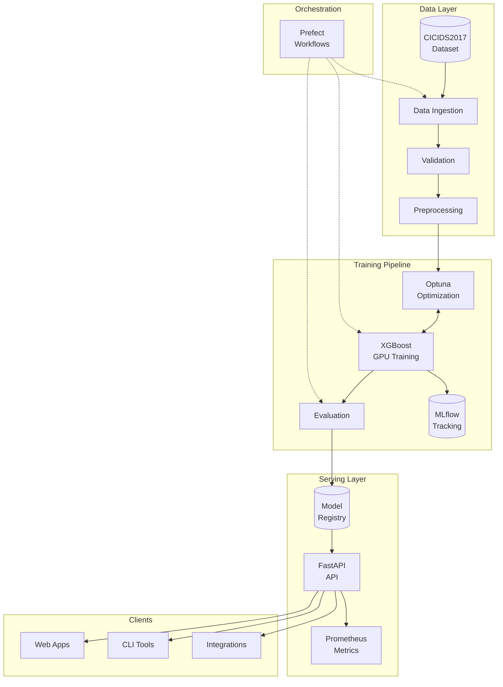
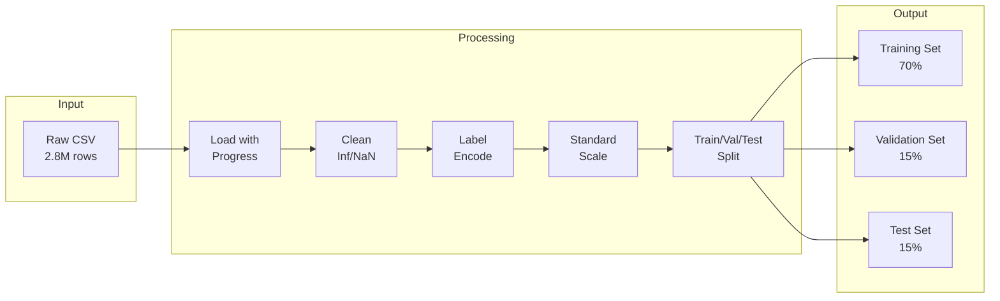
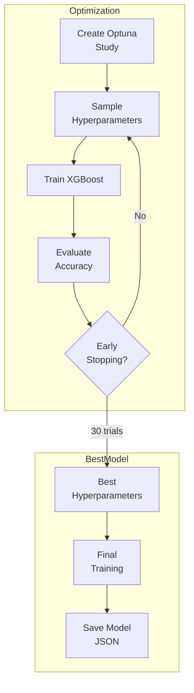
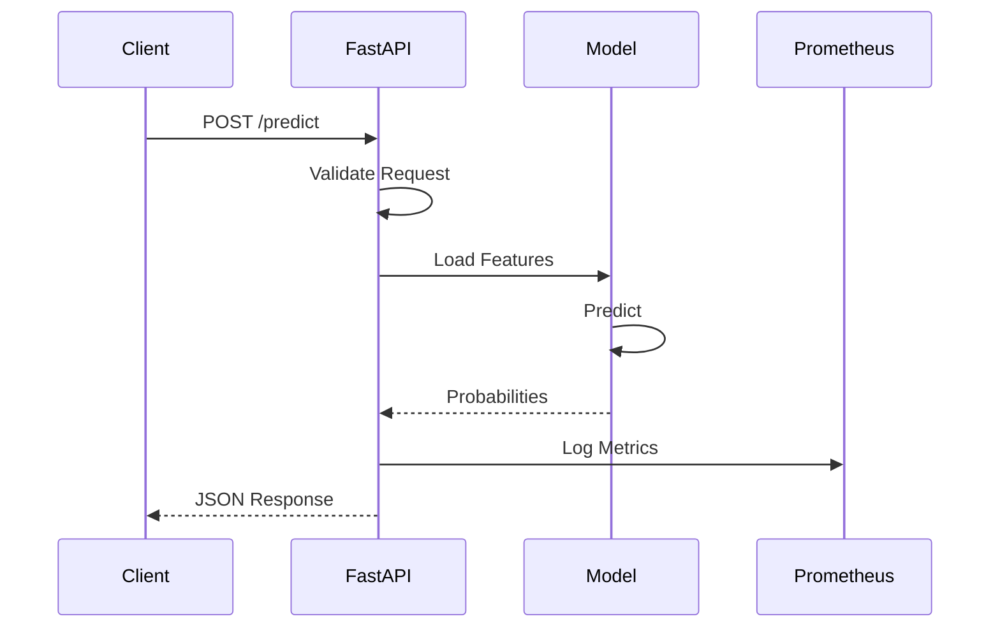
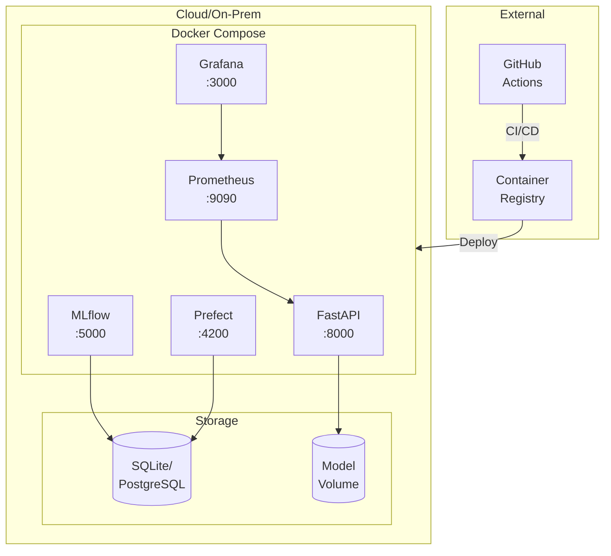
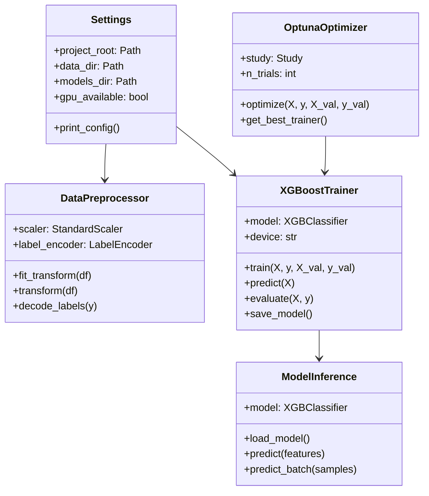

# WatchTower Architecture

This document provides detailed architecture diagrams for the WatchTower MLOps pipeline.

## System Overview

## Data Flow

## Training Pipeline

## API Request Flow

## Deployment Architecture

## Class Hierarchy

---

## Quick Reference

| Component | Technology | Port |
|-----------|------------|------|
| API | FastAPI + Uvicorn | 8000 |
| Experiments | MLflow | 5000 |
| Workflows | Prefect | 4200 |
| Metrics | Prometheus | 9090 |
| Dashboards | Grafana | 3000 |

---

## Author

**Ahmed Tarek** - Data Scientist & Machine Learning Engineer

- [LinkedIn](https://www.linkedin.com/in/ahmed-tarek-mel)
- [Portfolio](https://www.datascienceportfol.io/AhmedTarek)
- [Email](mailto:ahmedtarekmel@gmail.com)
